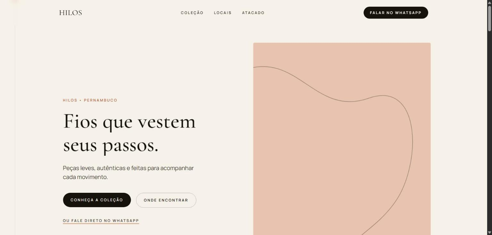

# HILOS

**Landing page de moda** · Next.js · TypeScript · Tailwind CSS

[](https://hilos-mvp.vercel.app)
[](https://nextjs.org)
[](https://www.typescriptlang.org)
[](https://tailwindcss.com)
[](https://www.framer.com/motion/)
[](LICENSE)

MVP de landing page para a HILOS, marca de moda de Pernambuco, construído a partir de um briefing de identidade visual ("HILOS — Fios em Movimento"): uma página única guiada por um fio condutor visual que nasce no hero, atravessa cada seção e volta a se conectar à marca no CTA final.

🔗 **Demo:** [hilos-mvp.vercel.app](https://hilos-mvp.vercel.app)
*(sem fotografia real e com dados comerciais de placeholder — ver [pendências](#pendências-de-conteúdo))*



> Projeto de portfólio: página inteira construída a partir de um briefing escrito, sem assets reais da marca. O objetivo é demonstrar tradução de um conceito de identidade visual em interface, não representar a HILOS oficialmente.

## Funcionalidades

- Hero com CTA duplo (coleção / onde encontrar) e atalho direto para WhatsApp
- Manifesto com texto revelado conforme o scroll
- Coleção em cards editoriais com tilt 3D e swipe horizontal no mobile
- Produto destaque com CTA que abre o WhatsApp com mensagem pré-pronta — o principal evento de conversão mensurável
- Seção "HILOS em Movimento" com locais e badges de status
- Atacado: formulário que monta a mensagem e abre no WhatsApp, sem backend
- Seção Instagram (`#usehilos`) com grade de placeholders para UGC
- O "fio": linha vertical que cresce com o scroll e acende um ponto em cada seção — a assinatura visual do briefing
- Eventos de analytics (GA4 / Meta Pixel) nos principais cliques de WhatsApp e no envio do formulário de atacado
- SEO completo: metadata, OpenGraph, `sitemap.xml`, `robots.txt`, JSON-LD (`ClothingStore`)

## Stack

- [Next.js 16](https://nextjs.org) (App Router) + React 19 + TypeScript
- Tailwind CSS v4
- [Framer Motion](https://www.framer.com/motion/), reveals em scroll, parallax e o fio animado

Projeto **frontend-only**: não há backend nem banco de dados — o formulário de atacado e os CTAs de produto convertem direto em um link do WhatsApp (`wa.me`) com mensagem pré-preenchida.

## Rodando localmente

```bash
git clone https://github.com/joaobatis1a/hilos-mvp.git
cd hilos-mvp
npm install
cp .env.example .env.local   # preencha WhatsApp, Instagram, GA4, Meta Pixel
npm run dev
```

Abra [http://localhost:3000](http://localhost:3000). Sem `.env.local` preenchido, o site roda normalmente com os placeholders do `.env.example`.

### Variáveis de ambiente

| Variável | Para quê |
|---|---|
| `NEXT_PUBLIC_SITE_URL` | URL de produção (metadata, sitemap, robots, OpenGraph) |
| `NEXT_PUBLIC_WHATSAPP_NUMBER` | Número da HILOS no formato `55DDDNUMERO`, sem símbolos |
| `NEXT_PUBLIC_INSTAGRAM_URL` | Link do perfil `@usehilos` |
| `NEXT_PUBLIC_GA_ID` | ID do Google Analytics 4 (`G-XXXXXXX`); se vazio, o script não carrega |
| `NEXT_PUBLIC_META_PIXEL_ID` | ID do Meta Pixel; se vazio, o script não carrega |

## Pendências de conteúdo

Não dá para resolver sem a marca real por trás do briefing:

- **Fotografia real** no lugar dos placeholders estilizados (cada um já indica, em legenda, o que deveria entrar ali)
- **História da marca** validada — o texto do Manifesto é um rascunho baseado no briefing
- **Status dos locais** (North Way, Eventos, Aldeia, Patteo Olinda) — as badges são placeholders
- **Número de WhatsApp, Instagram e logo vetorial** reais

## Deploy

Conectado à Vercel via CLI:

```bash
npm i -g vercel
vercel --prod
```

Configure as variáveis de ambiente acima no painel da Vercel (Project Settings → Environment Variables) antes do deploy de produção.

## Licença

Distribuído sob a licença MIT. Veja [LICENSE](LICENSE) para mais detalhes.
